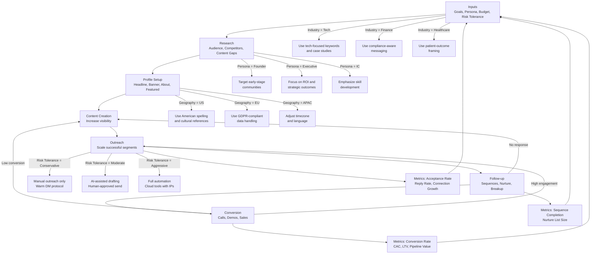

## Section 6: Pipeline Architecture

## Pipeline Architecture (06-pipeline-architecture):

## Section (Modified for readability)

The architecture follows a sequential flow from Inputs through Research, Profile Setup, Content Creation, Outreach, Follow-up, and Conversion, with feedback loops connecting later stages to earlier ones for continuous optimization. Decision nodes at key junctions enable parameter-driven branching for different industries, personas, geographies, and risk tolerances.

### 6.2 Pipeline Flow Diagram

### 6.3 Stage Descriptions

#### Stage 1: Inputs

The Inputs stage defines the parameters that drive all downstream decisions. These variables are collected at pipeline initialization and used to personalize tactic selection, messaging, content strategy, and risk thresholds.

**Required Input Variables:**

| Variable | Data Type | Valid Values | Default | Description |
|----------|-----------|--------------|---------|-------------|
| `target_industry` | String (enum) | tech, finance, healthcare, manufacturing, consulting, education, media, retail | "tech" | Primary industry of target audience |
| `target_persona` | String (enum) | founder, executive, manager, individual_contributor, recruiter, investor | "individual_contributor" | Role of ideal connection |
| `geography` | String (ISO code) | US, EU, APAC, global | "US" | Geographic focus |
| `risk_tolerance` | String (enum) | conservative, moderate, aggressive | "conservative" | Willingness to use gray-area or ToS-violating tactics |
| `automation_level` | String (enum) | manual, semi, automated | "manual" | Degree of automation acceptable |
| `budget_monthly` | Integer (USD) | 0–10000 | 0 | Monthly budget for tools |
| `current_connection_count` | Integer | 0–30000 | 0 | Current 1st-degree connections |
| `current_ssi_score` | Integer | 0–100 | 0 | Current Social Selling Index |
| `content_capacity` | Integer (hours/week) | 1–40 | 5 | Hours available for content |
| `time_to_goal_weeks` | Integer | 1–52 | 12 | Desired timeline |

[SOURCE: Community synthesis]

#### Stage 2: Research

The Research stage identifies the target audience, analyzes competitors, and maps content gaps. Outputs from this stage feed directly into Profile Setup and Content Creation.

**Activities:**
- Boolean search in Sales Navigator (if budget allows) to identify target accounts and prospects
- Competitor content analysis: identify top-performing post formats and topics in the niche
- Content gap analysis: identify questions and pain points not adequately addressed by existing content
- Keyword research: identify high-search-volume terms for headline and About section optimization

**Tools:**
- Sales Navigator ($80/month) for advanced search and lead lists
- LinkedIn native search (free) for basic prospecting
- Apollo.io ($49/month) for contact enrichment and intent data
- Clay.com ($185/month) for waterfall enrichment across 150+ data providers

**Metrics:**
- Target audience size identified
- Competitor post frequency and engagement rates
- Content gap opportunities mapped

#### Stage 3: Profile Setup

The Profile Setup stage optimizes all profile elements for conversion, not just visibility. The profile acts as a landing page for all outreach and content efforts.

**Activities:**
- Headline optimization: "I help [who] do [what] | [proof]" formula
- Banner design: transformation-focused visual with CTA
- About section: PAS framework (Problem, Agitate, Solution) + social proof + CTA
- Featured section: 3 high-value items (case studies, demos, booking links)
- Skills: 50 keywords, ordered strategically for search weighting
- Experience: position as offers, not job descriptions

**Tools:**
- Canva or Figma for banner design
- Apollo.io or Clay.com for competitor profile analysis
- LinkedIn native analytics for profile view tracking

**Metrics:**
- Profile views per week
- Search appearances
- Click-through rate on Featured section links

#### Stage 4: Content Creation

The Content Creation stage produces the assets that drive inbound discovery and establish topical authority. Content feeds the visibility flywheel that makes outreach more effective.

**Activities:**
- Post creation: 2x per week minimum, 800–1000 words or PDF carousel
- Commenting: 5–10 strategic comments daily (40+ words, Loop-Back Method)
- Content mix: educational (40%), case study/client story (30%), personal take/mindset (30%)
- Newsletter: weekly issue on core niche topic (if capacity allows)

**Tools:**
- n8n or Make for content scheduling (compliant, free/low-cost)
- Canva for carousel and image creation
- OpenAI/Anthropic for content ideation and drafting (human review required)
- LinkedIn native scheduling (free)

**Metrics:**
- Post impressions and engagement rate
- Profile views generated from content
- Comment reply rate
- Newsletter subscriber growth

#### Stage 5: Outreach

The Outreach stage executes connection requests, messages, and InMails based on the Warm DM protocol and parameterized risk tolerance.

**Activities:**
- Warm DM protocol: engage twice in comments before connecting
- Connection requests: under 80/week, personalized, no pitch
- Message sequences: 3–5 steps over 14–30 days
- InMail: reserved for high-value 3rd-degree prospects

**Decision Nodes:**
- If `risk_tolerance` = "conservative": manual outreach only, Warm DM protocol mandatory
- If `risk_tolerance` = "moderate": AI-assisted drafting with human approval
- If `risk_tolerance` = "aggressive": cloud automation tools with dedicated IPs

**Tools:**
- Apollo.io ($49/month) for manual task reminders and AI drafting
- Expandi ($99/month) for cloud automation (MEDIUM risk)
- LinkedIn native messaging (free, manual)
- Sales Navigator ($80/month) for InMail and advanced search

**Metrics:**
- Connection acceptance rate (target: 30–40%)
- Reply rate (target: 15–25%)
- Weekly connection growth

#### Stage 6: Follow-up

The Follow-up stage manages sequences, nurtures non-responders, and executes breakup messages.

**Activities:**
- Sequence management: Day 0 connect, Day 3–4 value message, Day 7–10 soft CTA, Day 30 breakup
- Nurture list: engage with content only after 5 touches with no response
- Re-approach: revisit in 3–6 months with new context

**Tools:**
- Apollo.io or Lemlist for sequence management
- n8n/Make for compliant nurture workflows (email + LinkedIn content)
- CRM (HubSpot, Salesforce) for pipeline tracking

**Metrics:**
- Sequence completion rate
- Nurture list size
- Re-engagement rate after 3–6 months

#### Stage 7: Conversion

The Conversion stage turns engaged connections into qualified leads, discovery calls, and customers.

**Activities:**
- CTA execution: book calls, share demos, send proposals
- Pipeline management: track stages from connection to close
- Handoff: transition from LinkedIn to CRM or sales process

**Tools:**
- Calendly or Chili Piper for booking
- HubSpot or Salesforce for CRM
- Stripe or PandaDoc for proposals and payments

**Metrics:**
- Discovery calls booked per month (target: 15–25 from 80 weekly connections)
- Conversion rate from connection to call
- Customer acquisition cost (CAC)
- Lifetime value (LTV)

### 6.4 Decision Nodes for Parameter Variants

The pipeline includes decision nodes at key junctions to adapt execution based on input parameters. These nodes enable the same pipeline to serve multiple industries, personas, geographies, and risk profiles without code changes.

#### Industry Variants

| Industry | Content Focus | Messaging Tone | Compliance Notes |
|----------|--------------|----------------|------------------|
| **Technology** | Product-led growth, engineering culture, technical tutorials | Direct, data-driven | Standard |
| **Finance** | Regulatory updates, ROI case studies, risk management | Formal, compliance-aware | GDPR, SEC regulations |
| **Healthcare** | Patient outcomes, clinical evidence, workflow efficiency | Empathetic, evidence-based | HIPAA, GDPR |
| **Manufacturing** | Operational efficiency, supply chain, Industry 4.0 | Practical, ROI-focused | Standard |
| **Consulting** | Thought leadership, frameworks, transformation stories | Authoritative, methodical | Standard |

#### Persona Variants

| Persona | Primary Pain Point | Value Proposition | CTA |
|---------|-------------------|-------------------|-----|
| **Founder** | Growth, funding, hiring | "Scale faster with less" | Strategy call |
| **Executive** | Strategy, ROI, competitive advantage | "Outperform competitors" | Executive briefing |
| **Manager** | Team performance, efficiency, retention | "Build high-performing teams" | Team assessment |
| **Individual Contributor** | Career growth, skill development, recognition | "Accelerate your career" | Career roadmap |
| **Recruiter** | Talent pipeline, time-to-hire, quality | "Find better candidates faster" | Demo |
| **Investor** | Deal flow, due diligence, portfolio growth | "Access exclusive opportunities" | Introduction |

#### Geography Variants

| Geography | Timezone | Language | Cultural Adjustments |
|-----------|----------|----------|---------------------|
| **US** | EST/PST priority | American English | Direct CTAs, achievement-focused |
| **EU** | CET priority | British/American English | GDPR compliance, relationship-first |
| **APAC** | JST/SGT/AEST priority | Local or English | Indirect CTAs, consensus-building |

#### Risk Tolerance Variants

| Risk Tolerance | Automation Level | Tools | Limits | Expected Growth |
|----------------|-----------------|-------|--------|-----------------|
| **Conservative** | Manual only | Native LinkedIn, Apollo.io (reminders) | 80 connections/week | 150–200/month |
| **Moderate** | AI-assisted, human-approved | Apollo.io, Waalaxy (drafting), n8n (posting) | 100 connections/week | 200–300/month |
| **Aggressive** | Full automation | Expandi, MeetAlfred, Phantombuster | 150 connections/week | 300–500/month |

### 6.5 Data Flow Between Stages

Data flows sequentially through the pipeline with feedback loops connecting later stages to earlier ones:

1. **Inputs → Research:** Input parameters (industry, persona, geography) constrain the research scope. Budget determines whether Sales Navigator and enrichment tools are used.

2. **Research → Profile Setup:** Research outputs (competitor keywords, content gaps, audience pain points) inform headline, About, and Featured section copy.

3. **Profile Setup → Content Creation:** Profile positioning determines content themes and tone. A founder targeting other founders will produce different content than a consultant targeting executives.

4. **Content Creation → Outreach:** Content engagement data (which posts get the most profile views) identifies warm prospects for outreach. Commenters on your posts become high-priority connection targets.

5. **Outreach → Follow-up:** Connection acceptance and reply data feed into sequence management. Accepted connections enter the sequence; non-acceptors move to nurture.

6. **Follow-up → Conversion:** Sequence completions and positive replies feed into the conversion pipeline. Breakup messages create a final opportunity for re-engagement.

7. **Conversion → Inputs (Feedback Loop):** Conversion data (which personas convert best, which content drives the most pipeline) refines input parameters for the next pipeline cycle.

8. **Conversion → Content Creation (Feedback Loop):** Top-performing content formats and topics are replicated. Low-performing content is deprioritized.

9. **Outreach → Research (Feedback Loop):** Outreach response patterns reveal new audience segments or pain points not identified in initial research.

### 6.6 Tool Integrations at Each Stage

| Pipeline Stage | Compliant Tools | Gray-Area Tools | ToS-Violating Tools | Integration Pattern |
|----------------|----------------|-----------------|---------------------|---------------------|
| **Research** | Sales Navigator, LinkedIn Search, Google | Apollo.io, Clay.com | Phantombuster (scraping) | API or manual export to CSV |
| **Profile Setup** | LinkedIn native, Canva | Apollo.io (insights) | — | Manual update |
| **Content Creation** | n8n, Make, LinkedIn native scheduling, Canva | OpenAI/Anthropic (drafting) | — | n8n/Make workflow for scheduling |
| **Outreach** | LinkedIn native, Apollo.io (manual reminders) | Apollo.io (AI drafting) | Expandi, Waalaxy, MeetAlfred, LinkedHelper2 | CRM sync via Zapier/Make |
| **Follow-up** | n8n/Make (email nurture), CRM | Apollo.io, Lemlist | Expandi, Waalaxy | Webhook-based sequence triggers |
| **Conversion** | Calendly, HubSpot, Salesforce, Stripe | — | — | CRM pipeline automation |

### 6.7 Metrics and Feedback Loops

#### Primary Metrics by Stage

| Stage | Primary Metric | Target | Measurement Frequency |
|-------|---------------|--------|----------------------|
| **Research** | Audience size identified | 500+ prospects | Per campaign |
| **Profile Setup** | Profile views per week | 200–500 | Weekly |
| **Content Creation** | Post engagement rate | 3–5% | Per post |
| **Outreach** | Connection acceptance rate | 30–40% | Weekly |
| **Follow-up** | Reply rate | 15–25% | Per sequence |
| **Conversion** | Calls booked per month | 15–25 | Monthly |

#### Feedback Loop Mechanisms

**Weekly Data Pivot:** Track Profile Views and Post Saves (not just Impressions). Impressions are volatile; members reached shows a steadier upward trend. Saves are the new trust signal — one save carries more weight than multiple likes. Weekly review prevents vanity metric chasing. [SOURCE: https://medium.com/@frankhfurness/linkedin-in-2026-the-game-has-changed-and-heres-how-to-win-it-464613e4178a | 2026-01-30 | HIGH]

**A/B Testing Framework:** Test one variable at a time (headline, CTA, post format, send time). Expandi reports 22% connection approval rate with optimized sequences versus 15% with default templates. [SOURCE: https://expandi.io/blog/boost-linkedin-conversions-with-trigger-based-outreach/ | 2025-05-13 | MEDIUM]

**Sequence Performance Review:** After every 100 connections sent, review acceptance rates by segment (industry, persona, message variant). Double down on top-performing segments; pause underperforming variants.

**Content-Outreach Correlation:** Measure the correlation between content posting and outreach acceptance. Accounts posting 2x per week see up to 5x more profile views, which directly improves outreach warmness. [SOURCE: https://medium.com/@frankhfurness/linkedin-in-2026-the-game-has-changed-and-heres-how-to-win-it-464613e4178a | 2026-01-30 | HIGH]

**Pipeline Velocity:** Track the median time from first connection request to discovery call booked. Target: under 14 days for warm prospects, under 30 days for cold prospects.

### 6.8 Compliance Boundaries

The pipeline architecture respects compliance boundaries through explicit decision nodes:

1. **Conservative path:** All actions are manual. No automation tools are used. n8n/Make are used only for content scheduling via official LinkedIn APIs. Warm DM protocol is mandatory.

2. **Moderate path:** AI assists with drafting and research, but all sends are human-approved. Apollo.io provides manual task reminders, not automated sends. n8n/Make handle compliant posting and email nurture.

3. **Aggressive path:** Full automation using cloud tools with dedicated IPs. This path violates LinkedIn ToS and carries a 23% ban rate within 90 days. The pipeline documents this risk explicitly and requires opt-in acknowledgment.

**Schema Validation Rules:**
- `risk_tolerance` = "conservative" forces `automation_level` = "manual" and excludes all ToS-violating tactics
- `previous_restrictions` = true forces `safe_weekly_connections` to 30 regardless of SSI score
- `budget_monthly` < $100 excludes Sales Navigator and all paid automation tools
- `time_to_goal_weeks` < 4 forces `automation_level` to "manual" or "semi" (no time to recover from restrictions)

[SOURCE: Community synthesis]

> **Cross-Reference:** For detailed analysis of the tools referenced in this pipeline architecture, see [Section 4: Tool and Automation Landscape](#section-4-tool-and-automation-landscape).